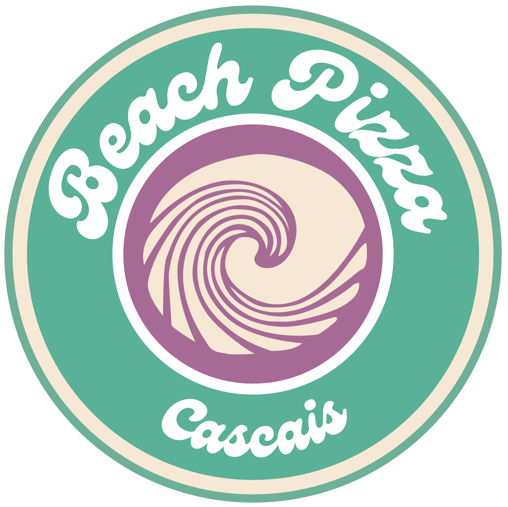

# 🌴 Mundo Beach

Site simples com links para documentos da empresa, com visual leve e tropical. Feito para facilitar o acesso a arquivos como escala e dicas.



## 📁 Funcionalidades

- Exibição da logo e nome do projeto
- Acesso rápido :
  - Tips.pdf
  - Escala.pdf
- Design estilizado com fontes do Google Fonts :
- Kavoon

## 💻 Tecnologias

- HTML5
- CSS3 (arquivo `style.css`)
- Google Fonts

## 🖼️ Layout

Fonte principal utilizada: **Kavoon**  
Logo incluída via imagem local: `./assets/logobp.png`

## 🚀 Como usar

1. Clone o repositório:
   ```bash
   git clone https://github.com/seuusuario/nomedorepositorio.git
